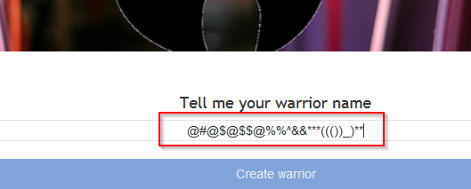
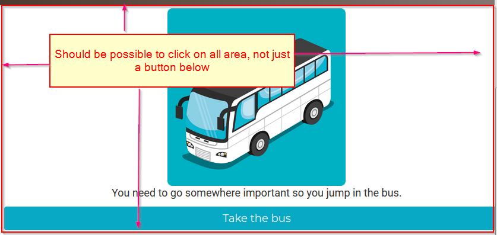
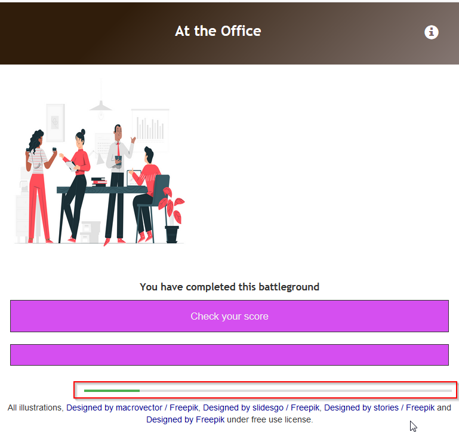

# Vodafone defects [Project  SuperHeroes and SuperVillain] https://responsivefight.herokuapp.com/

## 1. [Major] Constantly updating the home page
Description: Home page keep updating/refreshing

## 2. [Major] Username shouldn't accept special characters
Description: Username should accept only letters and digits

## 3. [Major] Proper user handling
Description: Should be possible to have the ability to log in/log out from the system and take the test multiple times

## 4. [Minor] The interface on the start screen is not user friendly
Description: Should be possible to click on all area, not just a button below

## 5. [Major] No information about current status of the game
Description: Should be visible overall number of the points and not just latest result

## 6. [Major] On the final screen with "Check your score" progress bar is not appropriate
Description: Nothing to measure on the final screen. Any notifications on that screen should be removed

