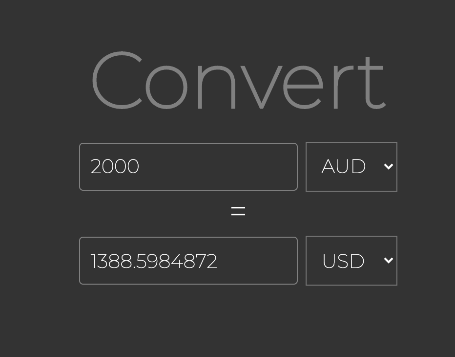
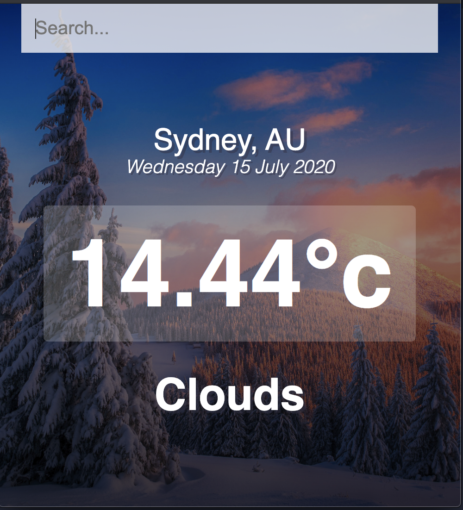
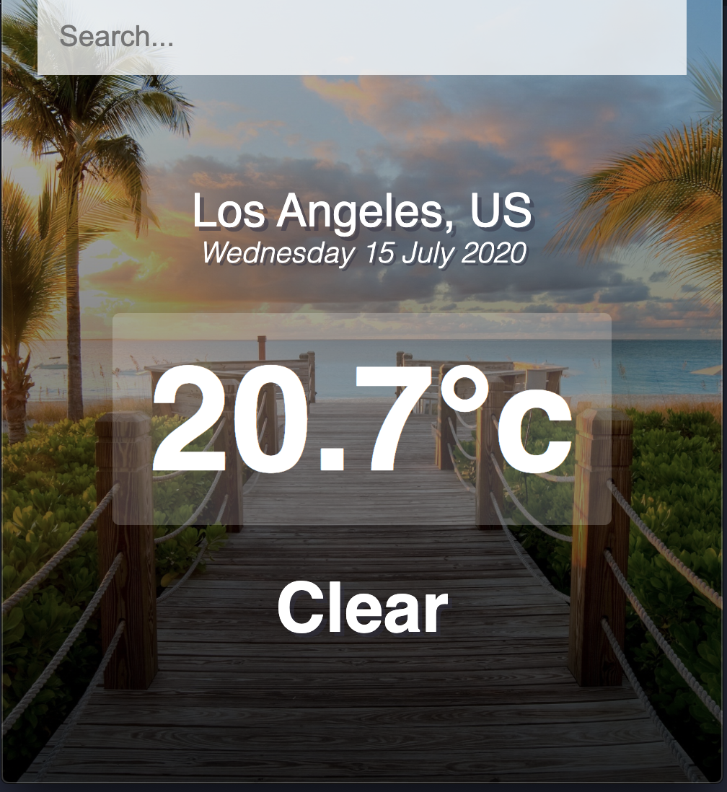
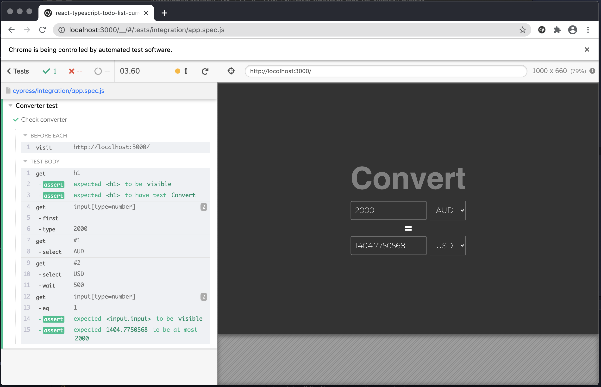
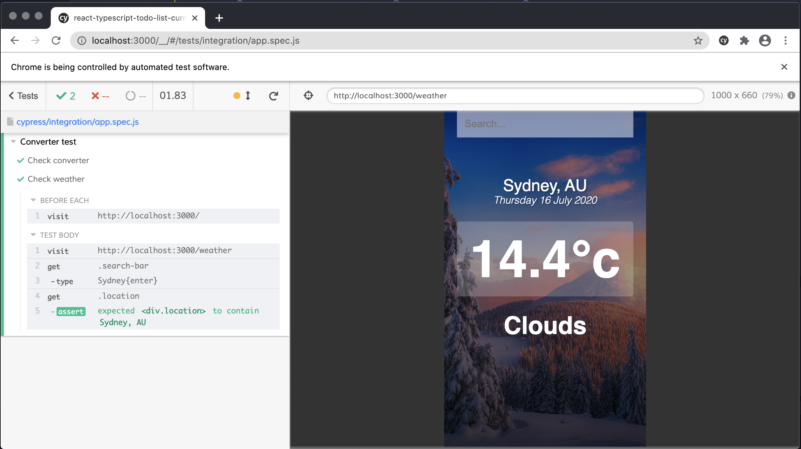

## Run

`npm start`

## Run Cypress tests

`npm run copen`

# Currency converter

React + Typescript application which is using api from https://api.exchangeratesapi.io/latest to convert from one currency to another
and fetching data from https://api.openweathermap.org/data/2.5/

## UI

## Cypress tests

## Vodafone challange (SuprHeroes and SuperVillain)

Execute `vodafone.spec.js`
